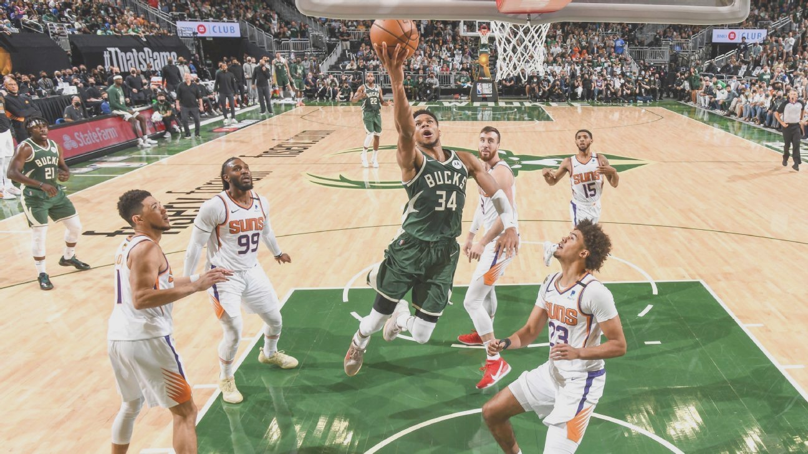
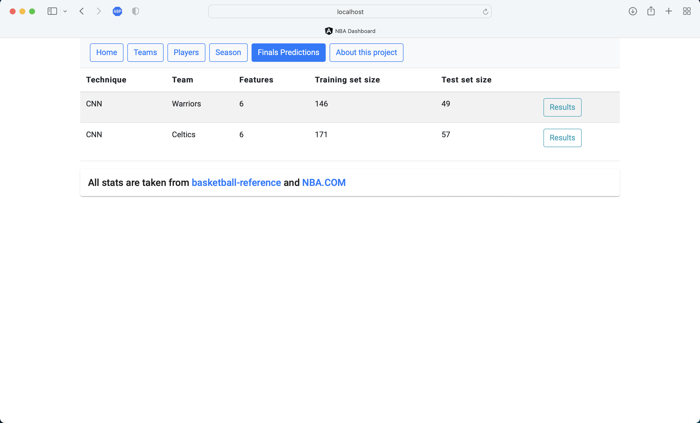

# NBA Dashboard

NBA Dashboard is a regular season game predictor based on papers found in [ScienceDirect](https://www.sciencedirect.com/science/article/pii/S2210832717301485) and [IJERT](https://www.ijert.org/prediction-of-winning-team-using-machine-learning)

  

[Image courtesy of ESPN](https://www.espn.com/nba/story/_/id/31803541/nba-finals-2021-milwaukee-bucks-waste-another-legendary-performance-giannis-antetokounmpo)
<br>
## Pre-requisites

* [.NET 6](https://dotnet.microsoft.com/en-us/download)
* [npm](https://nodejs.org/en/download/) or [yarn](https://classic.yarnpkg.com/lang/en/docs/install/#mac-stable) for packet management
* [use npm/yarn CLI to install Angular](https://angular.io/guide/setup-local)**

** Frontend runs Angular 10

<br>

## How to start NBA Dashboard

Either using dotnet CLI or Visual Studio 2022/Visual Studio Code

1. From /nbadashboard/NBAapi/NBAapi
```bash
dotnet build
```
2. then
```bash
dotnet run
```
3. This will get API and database initialized, we can also interact with the backend using OpenAPI via Swagger by entering http://localhost:53535/swagger

4. Next up; we'll build and run the frontend project with Angular CLI
```bash
ng build
```
5. Followed by
```bash
ng serve --open
```
6. This will take us to NBAdashbaord's landing page



## Contributing
Pull requests are welcome. For major changes, please open an issue first to discuss what you would like to change.


## License
[Apache](https://apache.org/licenses/LICENSE-2.0)
