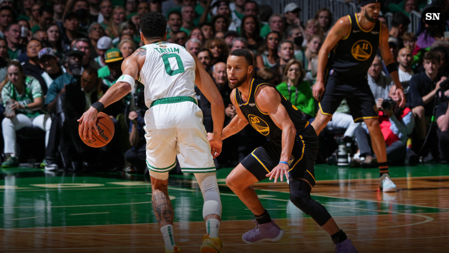

# NBA Dashboard

NBA Dashboard is a game predictor based on papers found in [ScienceDirect](https://www.sciencedirect.com/science/article/pii/S2210832717301485) and [IJERT](https://www.ijert.org/prediction-of-winning-team-using-machine-learning)

Data for games, box scores, all player and head-to-head stats, were scraped from [Basketball-Reference](http://basketball-reference.com), also possible thanks to [swar NBA api client](https://github.com/swar/nba_api)
  

[Image courtesy of Sporting News](https://www.sportingnews.com/us)

<br>
## Pre-requisites

* [.NET 6](https://dotnet.microsoft.com/en-us/download)
* [npm](https://nodejs.org/en/download/) or [yarn](https://classic.yarnpkg.com/lang/en/docs/install/#mac-stable) for package management
* [use npm/yarn CLI to install Angular](https://angular.io/guide/setup-local)**
* Junyper notebook enabled IDE/editor, environment configured preferably with [conda](https://docs.conda.io/en/latest/)

** Frontend runs Angular 10

<br>

## How to (install, build, run)

Either using dotnet CLI or Visual Studio 2022/Visual Studio Code

1. From /nbadashboard/NBAapi/NBAapi
```bash
dotnet build
```
2. then
```bash
dotnet run
```
3. This will get API and database initialized, we can also interact with the backend using OpenAPI via Swagger by entering http://localhost:53535/swagger

4. Next up; we'll build and run the frontend project with Angular CLI
```bash
ng build
```
5. Followed by
```bash
ng serve --open
```
6. This will take us to NBAdashbaord's landing page


## Roadmap 
### **Stage 1** [WE'RE HERE] 
##### Simple CRUD application where we can manage teams, players, games, and box scores.
 * Binary classification predictions using CNNs.

##### **Stage 2**
##### Improving prediction model.
  * Adding player per game stats to training sets.
  * Adding Data visualization
  * Improving data scraping and data collection

##### **Stage 3**
 * Migrate to cloud (azure/aws)
 * Compare ML.NET against current pyhon powered models.

## Contributing
Pull requests are welcome. For major changes, please open an issue first to discuss what you would like to change.


## License
[Apache](https://apache.org/licenses/LICENSE-2.0)
